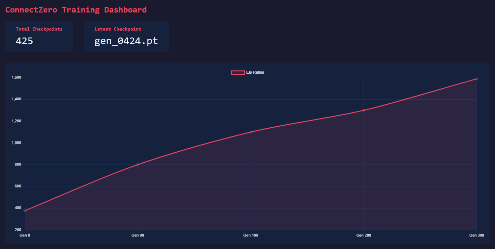
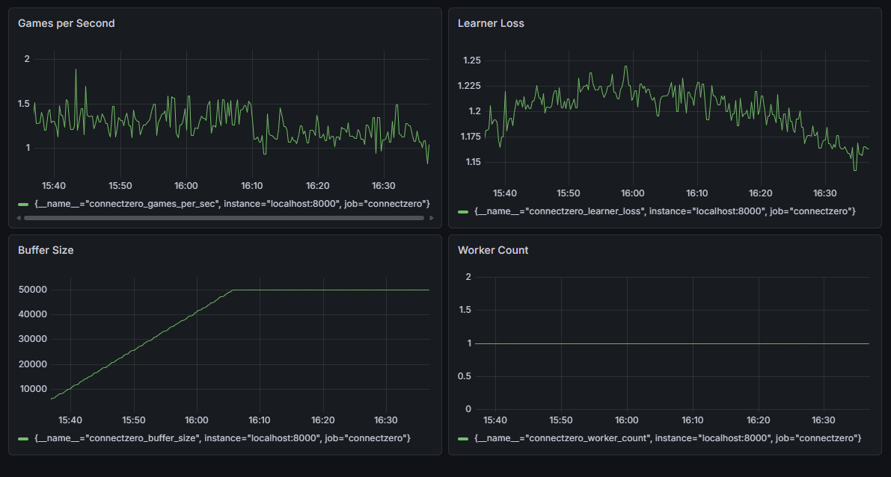
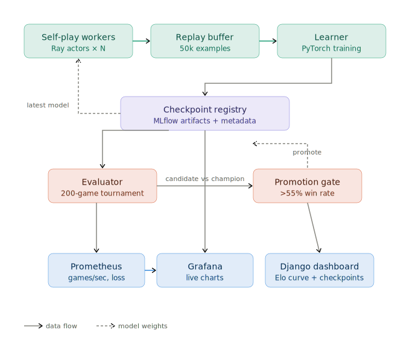

# ConnectZero

An AlphaZero-style self-play system that trains a Connect Four agent from scratch using distributed Ray workers, PyTorch, checkpoint gating, MLflow tracking, and Prometheus/Grafana observability. The agent starts with zero knowledge and improves purely through self-play, reaching Elo 1589 and 100% win rate vs minimax-depth-2 after 400 generations of training.

## Demo




## Architecture



## Results

| Metric | Value |
|---|---|
| Training generations | 425 |
| Final Elo | 1589.7 |
| Random baseline Elo | 376.7 |
| Elo improvement | +1213 points |
| Win rate vs random | 100% (100/100 games) |
| Win rate vs heuristic | 100% (100/100 games) |
| Win rate vs minimax-depth-2 | 100% (100/100 games) |
| Self-play throughput (1 worker) | 1.52 games/sec |
| Self-play throughput (2 workers) | 3.08 games/sec |
| Scaling speedup (1→2 workers) | 2.02x |

## Quickstart: local

```bash
git clone https://github.com/Reg21meme/ConnectZero.git
cd ConnectZero
make install
make test
python3 -m connectzero.cli play --agent heuristic
```

## Quickstart: Docker

```bash
make docker-build
make docker-train-small
```

## Training

```bash
python3 -m connectzero.cli train --config configs/local_cpu.yaml
```

## Evaluation

```bash
python3 scripts/export_results.py
```

## Scaling experiment

```bash
python3 scripts/scaling_experiment.py
```

## Dashboard

```bash
# Terminal 1 — start training with live metrics
python3 -m connectzero.cli train --config configs/local_cpu.yaml

# Terminal 2 — Django dashboard
cd dashboard && python3 manage.py runserver 8001
```

Open http://localhost:8001 for the training dashboard.

## Tech stack

| Tool | Purpose |
|---|---|
| PyTorch 2.12.1 | Policy/value network, training |
| Ray 2.56.0 | Distributed self-play workers |
| MLflow 3.9 | Experiment tracking, checkpoint artifacts |
| Prometheus | Metrics scraping |
| Grafana | Observability dashboard |
| Django 5 | Training dashboard, Elo curve, checkpoint table |
| Docker | Reproducible training environment |

## Algorithm

- Connect Four rules engine with gravity, win detection, draw detection
- Policy/value network: 4 residual blocks, 64 channels, 301k parameters
- MCTS with PUCT selection, 50 simulations per move
- Temperature schedule: exploratory for first 20 moves, greedy after
- Replay buffer: 50k examples, random sampling
- Checkpoint gating: candidate must win >55% over 200 games to be promoted
- Elo rating: computed via round-robin across checkpoint generations

## Limitations

- Connect Four is a solved game — this project demonstrates self-play RL infrastructure, not a novel game-theoretic result
- Training on CPU; a GPU would increase throughput significantly
- 2→4 worker scaling plateaus due to CPU core limits on a laptop

## Future work

- GPU training with batched MCTS inference
- League-based self-play
- 6x6 Othello as a harder domain
- C++ MCTS acceleration